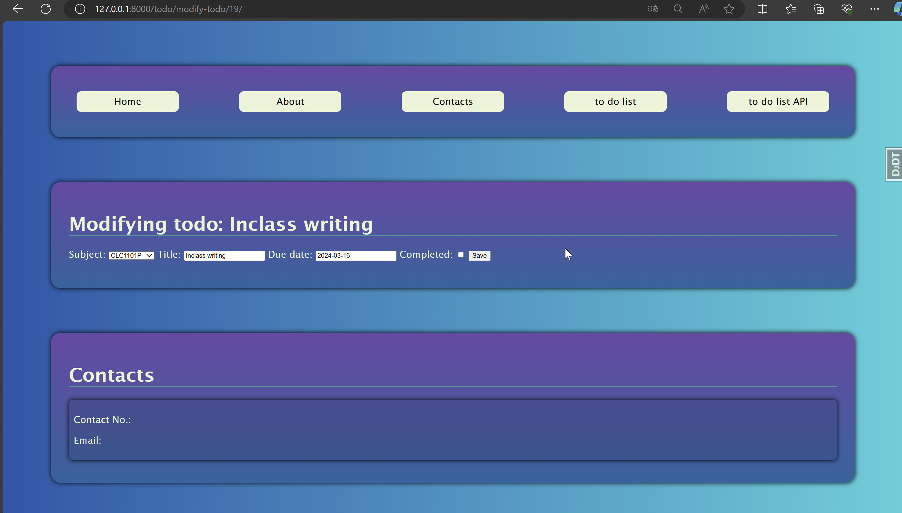

# To-do list web app

A to do list web application which has create, modify and delete function

Demonstration:

NOTE: For delete and modify operations, I used GET http method instead of PUT and DELETE, it is just my practice to work with server data in a more user-friendly way for this project, normally PUT or DELETE api/data/id should be used, just that I could not come up with a good approach to use these methods for this project
