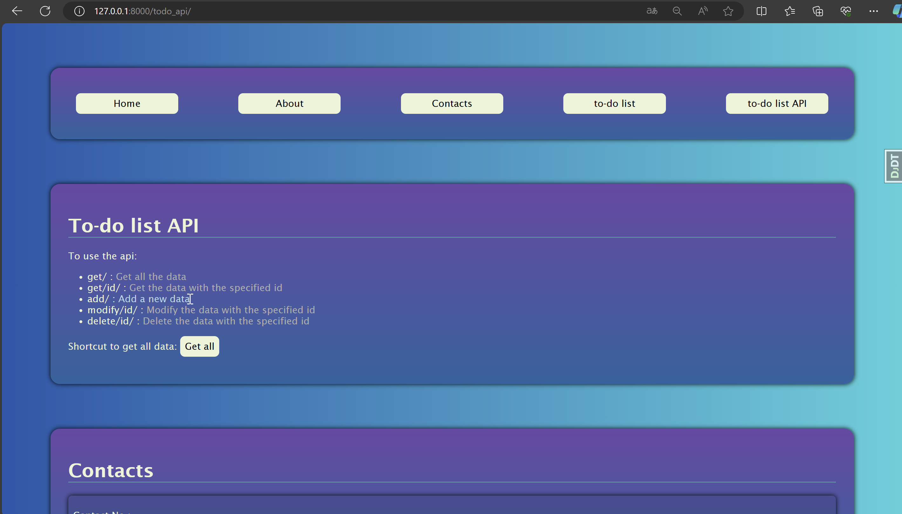

# To-do list web app

A to do list web application which has create, modify and delete function

## Instructions to run with docker:

1. get docker image through:

```
docker pull ngngka/todo-app-image
```

2. run the container:
```
docker-compose up
```

3. launch the webpage through http://localhost:8000/  

## Demonstration:
### Home page

### to-do list

### modify to-do item

### to-do api page

### to-do api view

### to-do api modification

### to-do api modification (result)
