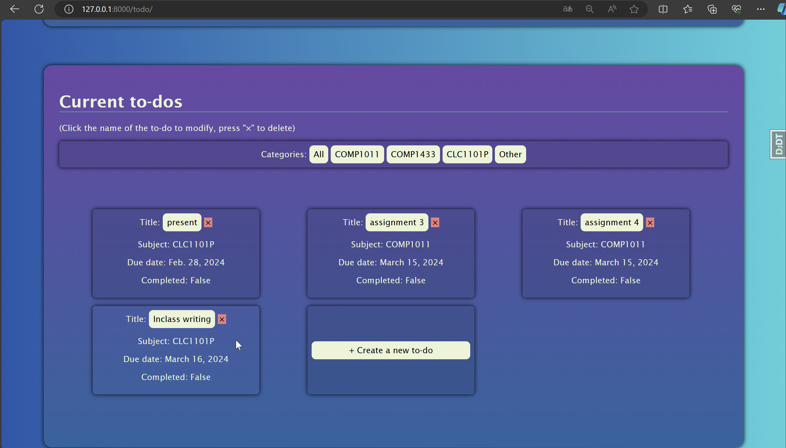

# To-do list web app

A to do list web application which has create, modify and delete function

Instructions to run with docker:

1. get docker image through:

```
docker pull ngngka/todo-app-image
```

2. run the container:
```
docker-compose up
```

3. launch the webpage through http://localhost:8000/  

Demonstration:




